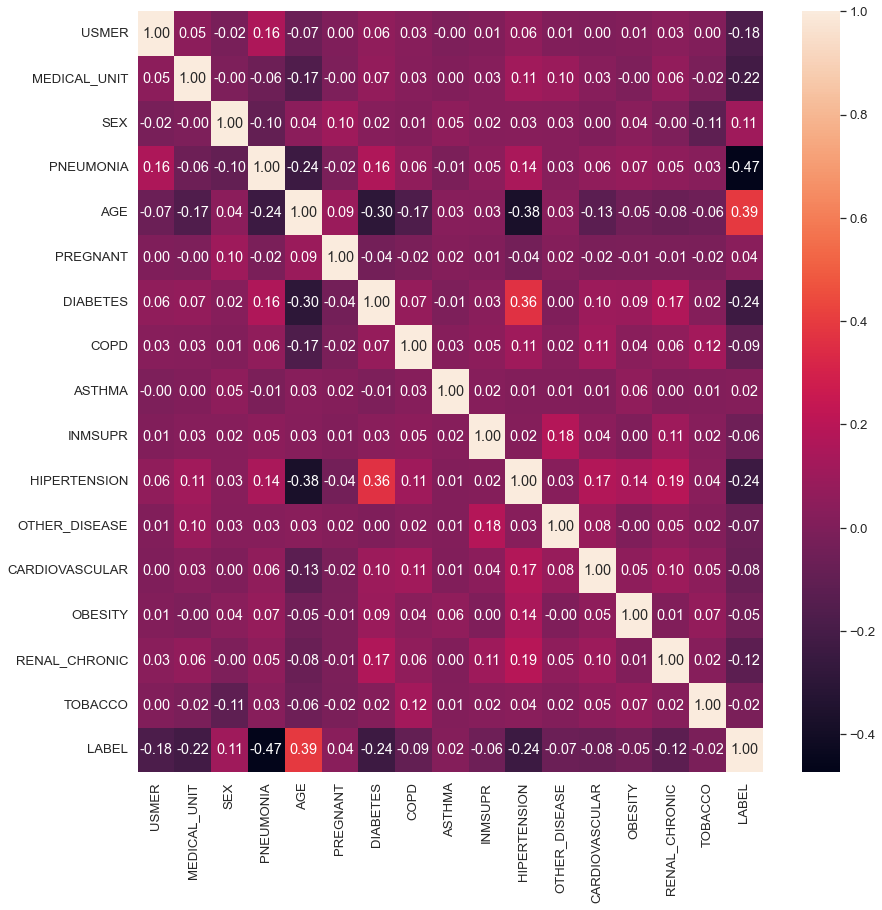

This project is the result of data science research workshop based on a Kaggle competition : https://www.kaggle.com/competitions/aresd-2023-covidchallenge/overview

# Objective  

The main objective of this project is to build a machine learning model that, given a Covid-19 patient's current symptoms, condition and medical history, will predict whether the patient is at high risk or not. The variable to be predicted is the variable LABEL which measures the severity of the COVID-19 infection and can take the values

SOFT_COVID : mild covid  
STRONG_COVID : covid requiring heavy medical care  
DEAD : fatal covid  

All models are implemented from scratch in Python3 with jupyter notebook. Some libraries are needed such as panda, numpy, and Matplotlib.  

Data needed : train.csv (in the same repo)  

(correlation heatmap with the seaborn library)

# Models  

1 - K-Nearest Neighbors  
2 - Naive Bayes  
3 - Decision Tree (CART)  
4 - Random Forest  

